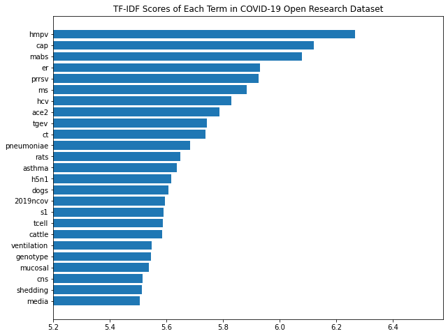
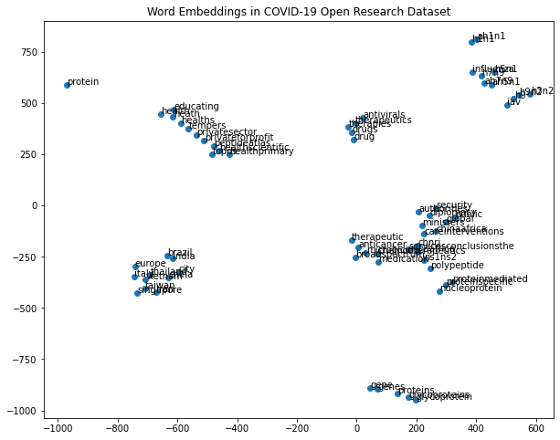

# Topic Modelling and Word Embeddings for COVID-19 Open Research Dataset

## Abstract

The COVID-19 open research dataset (CORD-19) have been prepared by the White House and a coalition of leading research groups, which contains over 52,000 scholarly articles, including over 41,000 with full text, about COVID-19, SARS-CoV-2, and related coronaviruses. Here I have created the latent semantic analysis and word embedding by using the COVID-19 open research dataset, which might lay a foundation for the future research purposes.

## Data Preprocessing

#### Download Data

First of all, let's download the data. The COVID-19 open research dataset provided by Kaggle contains several data sources, such as the meta data file, and several research papers. Here I chose to download the meta data file which contains the basic information such as titles, abstracts, authors of the research articles.


```
import os

# Create data folder
os.chdir('/content/')
!rm -rf data
!mkdir data
os.chdir('data')
!pwd

# Download data
!wget --output-document=metadata.csv "https://drive.google.com/uc?export=download&id=17OywCcDnEh8p3FF6AzbxI8s-r-MnSlst"
```

    /content/data
    --2020-04-18 14:35:45--  https://drive.google.com/uc?export=download&id=17OywCcDnEh8p3FF6AzbxI8s-r-MnSlst
    Resolving drive.google.com (drive.google.com)... 64.233.181.113, 64.233.181.138, 64.233.181.102, ...
    Connecting to drive.google.com (drive.google.com)|64.233.181.113|:443... connected.
    HTTP request sent, awaiting response... 302 Moved Temporarily
    Location: https://doc-04-34-docs.googleusercontent.com/docs/securesc/ha0ro937gcuc7l7deffksulhg5h7mbp1/vn8l7v5lacoonbs731clusvg85su0k49/1587220500000/05684750869889568925/*/17OywCcDnEh8p3FF6AzbxI8s-r-MnSlst?e=download [following]
    Warning: wildcards not supported in HTTP.
    --2020-04-18 14:35:48--  https://doc-04-34-docs.googleusercontent.com/docs/securesc/ha0ro937gcuc7l7deffksulhg5h7mbp1/vn8l7v5lacoonbs731clusvg85su0k49/1587220500000/05684750869889568925/*/17OywCcDnEh8p3FF6AzbxI8s-r-MnSlst?e=download
    Resolving doc-04-34-docs.googleusercontent.com (doc-04-34-docs.googleusercontent.com)... 172.253.114.132, 2607:f8b0:4001:c22::84
    Connecting to doc-04-34-docs.googleusercontent.com (doc-04-34-docs.googleusercontent.com)|172.253.114.132|:443... connected.
    HTTP request sent, awaiting response... 200 OK
    Length: unspecified [text/csv]
    Saving to: ‘metadata.csv’
    
    metadata.csv            [   <=>              ]  73.74M   154MB/s    in 0.5s    
    
    2020-04-18 14:35:49 (154 MB/s) - ‘metadata.csv’ saved [77323567]
    


#### Extract Documents

Considering that the abstract part of a research paper provides a brief summary of the research topic, therefore, here the abstracts from all the research papers are extracted as corpus.


```
import csv

corpus = []

# Open metadata file
with open('metadata.csv') as csv_file:
    
    csv_reader = csv.reader(csv_file, delimiter=',')
    next(csv_reader)

    # Extract abstracts from all the papers
    for lines in csv_reader:
        abstract = lines[8]
        corpus.append(abstract)

print('Total corpus extracted: {}'.format(len(corpus)))
print('Example:')
for i in range(5):
    sample = corpus[i]
    print('{}: {}'.format((i + 1), sample))
```

    Total corpus extracted: 51078
    Example:
    1: BACKGROUND: Rhinovirus, the most common cause of upper respiratory tract infections, has been implicated in asthma exacerbations and possibly asthma deaths. Although the method of transmission of rhinoviruses is disputed, several studies have demonstrated that aerosol transmission is a likely method of transmission among adults. As a first step in studies of possible airborne rhinovirus transmission, we developed methods to detect aerosolized rhinovirus by extending existing technology for detecting infectious agents in nasal specimens. METHODS: We aerosolized rhinovirus in a small aerosol chamber. Experiments were conducted with decreasing concentrations of rhinovirus. To determine the effect of UV irradiation on detection of rhinoviral aerosols, we also conducted experiments in which we exposed aerosols to a UV dose of 684 mJ/m(2). Aerosols were collected on Teflon filters and rhinovirus recovered in Qiagen AVL buffer using the Qiagen QIAamp Viral RNA Kit (Qiagen Corp., Valencia, California) followed by semi-nested RT-PCR and detection by gel electrophoresis. RESULTS: We obtained positive results from filter samples that had collected at least 1.3 TCID(50 )of aerosolized rhinovirus. Ultraviolet irradiation of airborne virus at doses much greater than those used in upper-room UV germicidal irradiation applications did not inhibit subsequent detection with the RT-PCR assay. CONCLUSION: The air sampling and extraction methodology developed in this study should be applicable to the detection of rhinovirus and other airborne viruses in the indoor air of offices and schools. This method, however, cannot distinguish UV inactivated virus from infectious viral particles.
    2: Recent analyses of human pathogens have revealed that their evolutionary histories are congruent with the hypothesized pattern of ancient and modern human population migrations. Phylogenetic trees of strains of the bacterium Helicobacter pylori and the polyoma JC virus taken from geographically diverse groups of human beings correlate closely with relationships of the populations in which they are found.
    3: The army of the men of death, in John Bunyan's memorable phrase, has a new recruit, and fear has a new face: a face wearing a surgical mask.
    4: BACKGROUND: The human leukocyte antigen (HLA) system is widely used as a strategy in the search for the etiology of infectious diseases and autoimmune disorders. During the Taiwan epidemic of severe acute respiratory syndrome (SARS), many health care workers were infected. In an effort to establish a screening program for high risk personal, the distribution of HLA class I and II alleles in case and control groups was examined for the presence of an association to a genetic susceptibly or resistance to SARS coronavirus infection. METHODS: HLA-class I and II allele typing by PCR-SSOP was performed on 37 cases of probable SARS, 28 fever patients excluded later as probable SARS, and 101 non-infected health care workers who were exposed or possibly exposed to SARS coronavirus. An additional control set of 190 normal healthy unrelated Taiwanese was also used in the analysis. RESULTS: Woolf and Haldane Odds ratio (OR) and corrected P-value (Pc) obtained from two tails Fisher exact test were used to show susceptibility of HLA class I or class II alleles with coronavirus infection. At first, when analyzing infected SARS patients and high risk health care workers groups, HLA-B*4601 (OR = 2.08, P = 0.04, Pc = n.s.) and HLA-B*5401 (OR = 5.44, P = 0.02, Pc = n.s.) appeared as the most probable elements that may be favoring SARS coronavirus infection. After selecting only a "severe cases" patient group from the infected "probable SARS" patient group and comparing them with the high risk health care workers group, the severity of SARS was shown to be significantly associated with HLA-B*4601 (P = 0.0008 or Pc = 0.0279). CONCLUSIONS: Densely populated regions with genetically related southern Asian populations appear to be more affected by the spreading of SARS infection. Up until recently, no probable SARS patients were reported among Taiwan indigenous peoples who are genetically distinct from the Taiwanese general population, have no HLA-B* 4601 and have high frequency of HLA-B* 1301. While increase of HLA-B* 4601 allele frequency was observed in the "Probable SARS infected" patient group, a further significant increase of the allele was seen in the "Severe cases" patient group. These results appeared to indicate association of HLA-B* 4601 with the severity of SARS infection in Asian populations. Independent studies are needed to test these results.
    5: BACKGROUND: An epidemic of a Severe Acute Respiratory Syndrome (SARS) caused by a new coronavirus has spread from the Guangdong province to the rest of China and to the world, with a puzzling contagion behavior. It is important both for predicting the future of the present outbreak and for implementing effective prophylactic measures, to identify the causes of this behavior. RESULTS: In this report, we show first that the standard Susceptible-Infected-Removed (SIR) model cannot account for the patterns observed in various regions where the disease spread. We develop a model involving two superimposed epidemics to study the recent spread of the SARS in Hong Kong and in the region. We explore the situation where these epidemics may be caused either by a virus and one or several mutants that changed its tropism, or by two unrelated viruses. This has important consequences for the future: the innocuous epidemic might still be there and generate, from time to time, variants that would have properties similar to those of SARS. CONCLUSION: We find that, in order to reconcile the existing data and the spread of the disease, it is convenient to suggest that a first milder outbreak protected against the SARS. Regions that had not seen the first epidemic, or that were affected simultaneously with the SARS suffered much more, with a very high percentage of persons affected. We also find regions where the data appear to be inconsistent, suggesting that they are incomplete or do not reflect an appropriate identification of SARS patients. Finally, we could, within the framework of the model, fix limits to the future development of the epidemic, allowing us to identify landmarks that may be useful to set up a monitoring system to follow the evolution of the epidemic. The model also suggests that there might exist a SARS precursor in a large reservoir, prompting for implementation of precautionary measures when the weather cools down.


#### Preprocess Data

Before working on the corpus, we need to preprocess the data by converting all the words to lower case, and also remove non-alphabet characters, such as punctuation marks.


```
import re

# Convert to lower case
corpus = [x.lower() for x in corpus]

# Remove non-alphabet characters
corpus = [re.sub(r'[^a-z0-9 ]+', '', x) for x in corpus]

print('After data clean-up:')
for i in range(5):
    sample = corpus[i]
    print('{}: {}'.format((i + 1), sample))
```

    After data clean-up:
    1: background rhinovirus the most common cause of upper respiratory tract infections has been implicated in asthma exacerbations and possibly asthma deaths although the method of transmission of rhinoviruses is disputed several studies have demonstrated that aerosol transmission is a likely method of transmission among adults as a first step in studies of possible airborne rhinovirus transmission we developed methods to detect aerosolized rhinovirus by extending existing technology for detecting infectious agents in nasal specimens methods we aerosolized rhinovirus in a small aerosol chamber experiments were conducted with decreasing concentrations of rhinovirus to determine the effect of uv irradiation on detection of rhinoviral aerosols we also conducted experiments in which we exposed aerosols to a uv dose of 684 mjm2 aerosols were collected on teflon filters and rhinovirus recovered in qiagen avl buffer using the qiagen qiaamp viral rna kit qiagen corp valencia california followed by seminested rtpcr and detection by gel electrophoresis results we obtained positive results from filter samples that had collected at least 13 tcid50 of aerosolized rhinovirus ultraviolet irradiation of airborne virus at doses much greater than those used in upperroom uv germicidal irradiation applications did not inhibit subsequent detection with the rtpcr assay conclusion the air sampling and extraction methodology developed in this study should be applicable to the detection of rhinovirus and other airborne viruses in the indoor air of offices and schools this method however cannot distinguish uv inactivated virus from infectious viral particles
    2: recent analyses of human pathogens have revealed that their evolutionary histories are congruent with the hypothesized pattern of ancient and modern human population migrations phylogenetic trees of strains of the bacterium helicobacter pylori and the polyoma jc virus taken from geographically diverse groups of human beings correlate closely with relationships of the populations in which they are found
    3: the army of the men of death in john bunyans memorable phrase has a new recruit and fear has a new face a face wearing a surgical mask
    4: background the human leukocyte antigen hla system is widely used as a strategy in the search for the etiology of infectious diseases and autoimmune disorders during the taiwan epidemic of severe acute respiratory syndrome sars many health care workers were infected in an effort to establish a screening program for high risk personal the distribution of hla class i and ii alleles in case and control groups was examined for the presence of an association to a genetic susceptibly or resistance to sars coronavirus infection methods hlaclass i and ii allele typing by pcrssop was performed on 37 cases of probable sars 28 fever patients excluded later as probable sars and 101 noninfected health care workers who were exposed or possibly exposed to sars coronavirus an additional control set of 190 normal healthy unrelated taiwanese was also used in the analysis results woolf and haldane odds ratio or and corrected pvalue pc obtained from two tails fisher exact test were used to show susceptibility of hla class i or class ii alleles with coronavirus infection at first when analyzing infected sars patients and high risk health care workers groups hlab4601 or  208 p  004 pc  ns and hlab5401 or  544 p  002 pc  ns appeared as the most probable elements that may be favoring sars coronavirus infection after selecting only a severe cases patient group from the infected probable sars patient group and comparing them with the high risk health care workers group the severity of sars was shown to be significantly associated with hlab4601 p  00008 or pc  00279 conclusions densely populated regions with genetically related southern asian populations appear to be more affected by the spreading of sars infection up until recently no probable sars patients were reported among taiwan indigenous peoples who are genetically distinct from the taiwanese general population have no hlab 4601 and have high frequency of hlab 1301 while increase of hlab 4601 allele frequency was observed in the probable sars infected patient group a further significant increase of the allele was seen in the severe cases patient group these results appeared to indicate association of hlab 4601 with the severity of sars infection in asian populations independent studies are needed to test these results
    5: background an epidemic of a severe acute respiratory syndrome sars caused by a new coronavirus has spread from the guangdong province to the rest of china and to the world with a puzzling contagion behavior it is important both for predicting the future of the present outbreak and for implementing effective prophylactic measures to identify the causes of this behavior results in this report we show first that the standard susceptibleinfectedremoved sir model cannot account for the patterns observed in various regions where the disease spread we develop a model involving two superimposed epidemics to study the recent spread of the sars in hong kong and in the region we explore the situation where these epidemics may be caused either by a virus and one or several mutants that changed its tropism or by two unrelated viruses this has important consequences for the future the innocuous epidemic might still be there and generate from time to time variants that would have properties similar to those of sars conclusion we find that in order to reconcile the existing data and the spread of the disease it is convenient to suggest that a first milder outbreak protected against the sars regions that had not seen the first epidemic or that were affected simultaneously with the sars suffered much more with a very high percentage of persons affected we also find regions where the data appear to be inconsistent suggesting that they are incomplete or do not reflect an appropriate identification of sars patients finally we could within the framework of the model fix limits to the future development of the epidemic allowing us to identify landmarks that may be useful to set up a monitoring system to follow the evolution of the epidemic the model also suggests that there might exist a sars precursor in a large reservoir prompting for implementation of precautionary measures when the weather cools down


Stop words, such as "because", "so", etc. in English, are defined as the commonly used words in any language, which are usually eliminated during natural language processing and text mining, in order to focus on the more important words. Based on my finding, the COVID-19 open research dataset contains research articles not only in English, but also in other European languages as well, such as Spanish and French. Therefore, we shall also consider precluding the interference from the stop words in the languages other than English.


```
import nltk

nltk.download('stopwords')

from nltk.corpus import stopwords

# Prepare stopwords for several languages
stop_words = list(stopwords.words('english'))
stop_words += list(stopwords.words('french'))
stop_words += list(stopwords.words('spanish'))

print(stop_words)
```

    [nltk_data] Downloading package stopwords to /root/nltk_data...
    [nltk_data]   Unzipping corpora/stopwords.zip.
    ['i', 'me', 'my', 'myself', 'we', 'our', 'ours', 'ourselves', 'you', "you're", "you've", "you'll", "you'd", 'your', 'yours', 'yourself', 'yourselves', 'he', 'him', 'his', 'himself', 'she', "she's", 'her', 'hers', 'herself', 'it', "it's", 'its', 'itself', 'they', 'them', 'their', 'theirs', 'themselves', 'what', 'which', 'who', 'whom', 'this', 'that', "that'll", 'these', 'those', 'am', 'is', 'are', 'was', 'were', 'be', 'been', 'being', 'have', 'has', 'had', 'having', 'do', 'does', 'did', 'doing', 'a', 'an', 'the', 'and', 'but', 'if', 'or', 'because', 'as', 'until', 'while', 'of', 'at', 'by', 'for', 'with', 'about', 'against', 'between', 'into', 'through', 'during', 'before', 'after', 'above', 'below', 'to', 'from', 'up', 'down', 'in', 'out', 'on', 'off', 'over', 'under', 'again', 'further', 'then', 'once', 'here', 'there', 'when', 'where', 'why', 'how', 'all', 'any', 'both', 'each', 'few', 'more', 'most', 'other', 'some', 'such', 'no', 'nor', 'not', 'only', 'own', 'same', 'so', 'than', 'too', 'very', 's', 't', 'can', 'will', 'just', 'don', "don't", 'should', "should've", 'now', 'd', 'll', 'm', 'o', 're', 've', 'y', 'ain', 'aren', "aren't", 'couldn', "couldn't", 'didn', "didn't", 'doesn', "doesn't", 'hadn', "hadn't", 'hasn', "hasn't", 'haven', "haven't", 'isn', "isn't", 'ma', 'mightn', "mightn't", 'mustn', "mustn't", 'needn', "needn't", 'shan', "shan't", 'shouldn', "shouldn't", 'wasn', "wasn't", 'weren', "weren't", 'won', "won't", 'wouldn', "wouldn't", 'au', 'aux', 'avec', 'ce', 'ces', 'dans', 'de', 'des', 'du', 'elle', 'en', 'et', 'eux', 'il', 'ils', 'je', 'la', 'le', 'les', 'leur', 'lui', 'ma', 'mais', 'me', 'même', 'mes', 'moi', 'mon', 'ne', 'nos', 'notre', 'nous', 'on', 'ou', 'par', 'pas', 'pour', 'qu', 'que', 'qui', 'sa', 'se', 'ses', 'son', 'sur', 'ta', 'te', 'tes', 'toi', 'ton', 'tu', 'un', 'une', 'vos', 'votre', 'vous', 'c', 'd', 'j', 'l', 'à', 'm', 'n', 's', 't', 'y', 'été', 'étée', 'étées', 'étés', 'étant', 'étante', 'étants', 'étantes', 'suis', 'es', 'est', 'sommes', 'êtes', 'sont', 'serai', 'seras', 'sera', 'serons', 'serez', 'seront', 'serais', 'serait', 'serions', 'seriez', 'seraient', 'étais', 'était', 'étions', 'étiez', 'étaient', 'fus', 'fut', 'fûmes', 'fûtes', 'furent', 'sois', 'soit', 'soyons', 'soyez', 'soient', 'fusse', 'fusses', 'fût', 'fussions', 'fussiez', 'fussent', 'ayant', 'ayante', 'ayantes', 'ayants', 'eu', 'eue', 'eues', 'eus', 'ai', 'as', 'avons', 'avez', 'ont', 'aurai', 'auras', 'aura', 'aurons', 'aurez', 'auront', 'aurais', 'aurait', 'aurions', 'auriez', 'auraient', 'avais', 'avait', 'avions', 'aviez', 'avaient', 'eut', 'eûmes', 'eûtes', 'eurent', 'aie', 'aies', 'ait', 'ayons', 'ayez', 'aient', 'eusse', 'eusses', 'eût', 'eussions', 'eussiez', 'eussent', 'de', 'la', 'que', 'el', 'en', 'y', 'a', 'los', 'del', 'se', 'las', 'por', 'un', 'para', 'con', 'no', 'una', 'su', 'al', 'lo', 'como', 'más', 'pero', 'sus', 'le', 'ya', 'o', 'este', 'sí', 'porque', 'esta', 'entre', 'cuando', 'muy', 'sin', 'sobre', 'también', 'me', 'hasta', 'hay', 'donde', 'quien', 'desde', 'todo', 'nos', 'durante', 'todos', 'uno', 'les', 'ni', 'contra', 'otros', 'ese', 'eso', 'ante', 'ellos', 'e', 'esto', 'mí', 'antes', 'algunos', 'qué', 'unos', 'yo', 'otro', 'otras', 'otra', 'él', 'tanto', 'esa', 'estos', 'mucho', 'quienes', 'nada', 'muchos', 'cual', 'poco', 'ella', 'estar', 'estas', 'algunas', 'algo', 'nosotros', 'mi', 'mis', 'tú', 'te', 'ti', 'tu', 'tus', 'ellas', 'nosotras', 'vosotros', 'vosotras', 'os', 'mío', 'mía', 'míos', 'mías', 'tuyo', 'tuya', 'tuyos', 'tuyas', 'suyo', 'suya', 'suyos', 'suyas', 'nuestro', 'nuestra', 'nuestros', 'nuestras', 'vuestro', 'vuestra', 'vuestros', 'vuestras', 'esos', 'esas', 'estoy', 'estás', 'está', 'estamos', 'estáis', 'están', 'esté', 'estés', 'estemos', 'estéis', 'estén', 'estaré', 'estarás', 'estará', 'estaremos', 'estaréis', 'estarán', 'estaría', 'estarías', 'estaríamos', 'estaríais', 'estarían', 'estaba', 'estabas', 'estábamos', 'estabais', 'estaban', 'estuve', 'estuviste', 'estuvo', 'estuvimos', 'estuvisteis', 'estuvieron', 'estuviera', 'estuvieras', 'estuviéramos', 'estuvierais', 'estuvieran', 'estuviese', 'estuvieses', 'estuviésemos', 'estuvieseis', 'estuviesen', 'estando', 'estado', 'estada', 'estados', 'estadas', 'estad', 'he', 'has', 'ha', 'hemos', 'habéis', 'han', 'haya', 'hayas', 'hayamos', 'hayáis', 'hayan', 'habré', 'habrás', 'habrá', 'habremos', 'habréis', 'habrán', 'habría', 'habrías', 'habríamos', 'habríais', 'habrían', 'había', 'habías', 'habíamos', 'habíais', 'habían', 'hube', 'hubiste', 'hubo', 'hubimos', 'hubisteis', 'hubieron', 'hubiera', 'hubieras', 'hubiéramos', 'hubierais', 'hubieran', 'hubiese', 'hubieses', 'hubiésemos', 'hubieseis', 'hubiesen', 'habiendo', 'habido', 'habida', 'habidos', 'habidas', 'soy', 'eres', 'es', 'somos', 'sois', 'son', 'sea', 'seas', 'seamos', 'seáis', 'sean', 'seré', 'serás', 'será', 'seremos', 'seréis', 'serán', 'sería', 'serías', 'seríamos', 'seríais', 'serían', 'era', 'eras', 'éramos', 'erais', 'eran', 'fui', 'fuiste', 'fue', 'fuimos', 'fuisteis', 'fueron', 'fuera', 'fueras', 'fuéramos', 'fuerais', 'fueran', 'fuese', 'fueses', 'fuésemos', 'fueseis', 'fuesen', 'sintiendo', 'sentido', 'sentida', 'sentidos', 'sentidas', 'siente', 'sentid', 'tengo', 'tienes', 'tiene', 'tenemos', 'tenéis', 'tienen', 'tenga', 'tengas', 'tengamos', 'tengáis', 'tengan', 'tendré', 'tendrás', 'tendrá', 'tendremos', 'tendréis', 'tendrán', 'tendría', 'tendrías', 'tendríamos', 'tendríais', 'tendrían', 'tenía', 'tenías', 'teníamos', 'teníais', 'tenían', 'tuve', 'tuviste', 'tuvo', 'tuvimos', 'tuvisteis', 'tuvieron', 'tuviera', 'tuvieras', 'tuviéramos', 'tuvierais', 'tuvieran', 'tuviese', 'tuvieses', 'tuviésemos', 'tuvieseis', 'tuviesen', 'teniendo', 'tenido', 'tenida', 'tenidos', 'tenidas', 'tened']


## Latent Semantic Analysis

Latent Semantic Analysis, or LSA, refers to one of the techniques to discern the latent semantic concepts by analyzing the documents. Here we will create a topic modelling by using the COVID-19 open research dataset.

#### Create Document-Term Matrix

Document-Term Matrix is a mathematical matrix that describes the frequency of terms that occur in a collection of documents. 

One of the measurement is TF-IDF. 

"TF" refers to the Term-Frequency, which describes the frequency of a particular word appearing in a certain document. In the formula below, $n_{i,j}$ refers to the total number of times that term $t_{i}$ appears in the document $d_j$. Therefore, $TF_{i,j}$ refers to the frequency that term $t_{i}$ appears in the document $d_j$.

$TF_{i,j}=\frac{n_{i,j}}{\sum_k^m(n_{k,j})}$

"IDF" refers to the Inverse Document Frequency, which describes the frequency of a particular word appearing in all the documents in the corpus. In the formula below, $D$ refers to the total number of documents, and $j:t_i\in d_j$ refers to the total number of documents which contains such term. The reason why we plus 1 to $j:t_i\in d_j$ is to preclude the case when the denominator is 0.

$IDF_{i}=\lg{\frac{D}{1+j:t_i\in d_j}}$

Then, the statistical calculation involves the product of "TF" and "IDF".

$TF-IDF = TF \times IDF$


```
from sklearn.feature_extraction.text import TfidfVectorizer
import pandas as pd

# Create document-term matrix through TF-IDF
vectorizer = TfidfVectorizer(stop_words=stop_words, 
                             max_features=1000)
X = vectorizer.fit_transform(corpus)
terms = vectorizer.get_feature_names()

# Check the shape
print(X.shape)

# Show document-term matrix
terms_df = pd.DataFrame(X.toarray(), columns=terms)
terms_df.sort_index().head(10)
```

    (51078, 1000)


<div>
<style scoped>
    .dataframe tbody tr th:only-of-type {
        vertical-align: middle;
    }

    .dataframe tbody tr th {
        vertical-align: top;
    }

    .dataframe thead th {
        text-align: right;
    }
</style>
<table border="1" class="dataframe">
  <thead>
    <tr style="text-align: right;">
      <th></th>
      <th>10</th>
      <th>100</th>
      <th>11</th>
      <th>12</th>
      <th>13</th>
      <th>14</th>
      <th>15</th>
      <th>16</th>
      <th>17</th>
      <th>18</th>
      <th>20</th>
      <th>2003</th>
      <th>2009</th>
      <th>2019</th>
      <th>2019ncov</th>
      <th>2020</th>
      <th>21</th>
      <th>23</th>
      <th>24</th>
      <th>25</th>
      <th>30</th>
      <th>40</th>
      <th>50</th>
      <th>60</th>
      <th>95</th>
      <th>ability</th>
      <th>able</th>
      <th>absence</th>
      <th>abstract</th>
      <th>according</th>
      <th>ace2</th>
      <th>acid</th>
      <th>acids</th>
      <th>across</th>
      <th>action</th>
      <th>activation</th>
      <th>active</th>
      <th>activities</th>
      <th>activity</th>
      <th>acute</th>
      <th>...</th>
      <th>variety</th>
      <th>various</th>
      <th>vector</th>
      <th>vectors</th>
      <th>ventilation</th>
      <th>version</th>
      <th>via</th>
      <th>viral</th>
      <th>virions</th>
      <th>virulence</th>
      <th>virus</th>
      <th>viruses</th>
      <th>vitro</th>
      <th>vivo</th>
      <th>vs</th>
      <th>water</th>
      <th>weeks</th>
      <th>weight</th>
      <th>well</th>
      <th>western</th>
      <th>whereas</th>
      <th>whether</th>
      <th>whole</th>
      <th>wide</th>
      <th>widely</th>
      <th>wild</th>
      <th>wildtype</th>
      <th>within</th>
      <th>without</th>
      <th>work</th>
      <th>workers</th>
      <th>world</th>
      <th>worldwide</th>
      <th>would</th>
      <th>wuhan</th>
      <th>year</th>
      <th>years</th>
      <th>yet</th>
      <th>young</th>
      <th>zoonotic</th>
    </tr>
  </thead>
  <tbody>
    <tr>
      <th>0</th>
      <td>0.0</td>
      <td>0.000000</td>
      <td>0.0</td>
      <td>0.0</td>
      <td>0.0778</td>
      <td>0.0</td>
      <td>0.0</td>
      <td>0.0</td>
      <td>0.0</td>
      <td>0.0</td>
      <td>0.0</td>
      <td>0.000000</td>
      <td>0.0</td>
      <td>0.0</td>
      <td>0.0</td>
      <td>0.0</td>
      <td>0.0</td>
      <td>0.0</td>
      <td>0.0</td>
      <td>0.0</td>
      <td>0.000000</td>
      <td>0.0</td>
      <td>0.0</td>
      <td>0.0</td>
      <td>0.000000</td>
      <td>0.0</td>
      <td>0.0</td>
      <td>0.0</td>
      <td>0.0</td>
      <td>0.0</td>
      <td>0.0</td>
      <td>0.0</td>
      <td>0.0</td>
      <td>0.000000</td>
      <td>0.000000</td>
      <td>0.000000</td>
      <td>0.000000</td>
      <td>0.0</td>
      <td>0.000000</td>
      <td>0.000000</td>
      <td>...</td>
      <td>0.0</td>
      <td>0.000000</td>
      <td>0.00000</td>
      <td>0.0</td>
      <td>0.0</td>
      <td>0.0</td>
      <td>0.000000</td>
      <td>0.078816</td>
      <td>0.0</td>
      <td>0.0</td>
      <td>0.068105</td>
      <td>0.043793</td>
      <td>0.0</td>
      <td>0.0</td>
      <td>0.0</td>
      <td>0.0</td>
      <td>0.0</td>
      <td>0.0</td>
      <td>0.000000</td>
      <td>0.0</td>
      <td>0.0</td>
      <td>0.0</td>
      <td>0.0</td>
      <td>0.000000</td>
      <td>0.000000</td>
      <td>0.0</td>
      <td>0.0</td>
      <td>0.000000</td>
      <td>0.0</td>
      <td>0.0</td>
      <td>0.000000</td>
      <td>0.000000</td>
      <td>0.0</td>
      <td>0.000000</td>
      <td>0.0</td>
      <td>0.0</td>
      <td>0.0</td>
      <td>0.0</td>
      <td>0.0</td>
      <td>0.0</td>
    </tr>
    <tr>
      <th>1</th>
      <td>0.0</td>
      <td>0.000000</td>
      <td>0.0</td>
      <td>0.0</td>
      <td>0.0000</td>
      <td>0.0</td>
      <td>0.0</td>
      <td>0.0</td>
      <td>0.0</td>
      <td>0.0</td>
      <td>0.0</td>
      <td>0.000000</td>
      <td>0.0</td>
      <td>0.0</td>
      <td>0.0</td>
      <td>0.0</td>
      <td>0.0</td>
      <td>0.0</td>
      <td>0.0</td>
      <td>0.0</td>
      <td>0.000000</td>
      <td>0.0</td>
      <td>0.0</td>
      <td>0.0</td>
      <td>0.000000</td>
      <td>0.0</td>
      <td>0.0</td>
      <td>0.0</td>
      <td>0.0</td>
      <td>0.0</td>
      <td>0.0</td>
      <td>0.0</td>
      <td>0.0</td>
      <td>0.000000</td>
      <td>0.000000</td>
      <td>0.000000</td>
      <td>0.000000</td>
      <td>0.0</td>
      <td>0.000000</td>
      <td>0.000000</td>
      <td>...</td>
      <td>0.0</td>
      <td>0.000000</td>
      <td>0.00000</td>
      <td>0.0</td>
      <td>0.0</td>
      <td>0.0</td>
      <td>0.000000</td>
      <td>0.000000</td>
      <td>0.0</td>
      <td>0.0</td>
      <td>0.112878</td>
      <td>0.000000</td>
      <td>0.0</td>
      <td>0.0</td>
      <td>0.0</td>
      <td>0.0</td>
      <td>0.0</td>
      <td>0.0</td>
      <td>0.000000</td>
      <td>0.0</td>
      <td>0.0</td>
      <td>0.0</td>
      <td>0.0</td>
      <td>0.000000</td>
      <td>0.000000</td>
      <td>0.0</td>
      <td>0.0</td>
      <td>0.000000</td>
      <td>0.0</td>
      <td>0.0</td>
      <td>0.000000</td>
      <td>0.000000</td>
      <td>0.0</td>
      <td>0.000000</td>
      <td>0.0</td>
      <td>0.0</td>
      <td>0.0</td>
      <td>0.0</td>
      <td>0.0</td>
      <td>0.0</td>
    </tr>
    <tr>
      <th>2</th>
      <td>0.0</td>
      <td>0.000000</td>
      <td>0.0</td>
      <td>0.0</td>
      <td>0.0000</td>
      <td>0.0</td>
      <td>0.0</td>
      <td>0.0</td>
      <td>0.0</td>
      <td>0.0</td>
      <td>0.0</td>
      <td>0.000000</td>
      <td>0.0</td>
      <td>0.0</td>
      <td>0.0</td>
      <td>0.0</td>
      <td>0.0</td>
      <td>0.0</td>
      <td>0.0</td>
      <td>0.0</td>
      <td>0.000000</td>
      <td>0.0</td>
      <td>0.0</td>
      <td>0.0</td>
      <td>0.000000</td>
      <td>0.0</td>
      <td>0.0</td>
      <td>0.0</td>
      <td>0.0</td>
      <td>0.0</td>
      <td>0.0</td>
      <td>0.0</td>
      <td>0.0</td>
      <td>0.000000</td>
      <td>0.000000</td>
      <td>0.000000</td>
      <td>0.000000</td>
      <td>0.0</td>
      <td>0.000000</td>
      <td>0.000000</td>
      <td>...</td>
      <td>0.0</td>
      <td>0.000000</td>
      <td>0.00000</td>
      <td>0.0</td>
      <td>0.0</td>
      <td>0.0</td>
      <td>0.000000</td>
      <td>0.000000</td>
      <td>0.0</td>
      <td>0.0</td>
      <td>0.000000</td>
      <td>0.000000</td>
      <td>0.0</td>
      <td>0.0</td>
      <td>0.0</td>
      <td>0.0</td>
      <td>0.0</td>
      <td>0.0</td>
      <td>0.000000</td>
      <td>0.0</td>
      <td>0.0</td>
      <td>0.0</td>
      <td>0.0</td>
      <td>0.000000</td>
      <td>0.000000</td>
      <td>0.0</td>
      <td>0.0</td>
      <td>0.000000</td>
      <td>0.0</td>
      <td>0.0</td>
      <td>0.000000</td>
      <td>0.000000</td>
      <td>0.0</td>
      <td>0.000000</td>
      <td>0.0</td>
      <td>0.0</td>
      <td>0.0</td>
      <td>0.0</td>
      <td>0.0</td>
      <td>0.0</td>
    </tr>
    <tr>
      <th>3</th>
      <td>0.0</td>
      <td>0.000000</td>
      <td>0.0</td>
      <td>0.0</td>
      <td>0.0000</td>
      <td>0.0</td>
      <td>0.0</td>
      <td>0.0</td>
      <td>0.0</td>
      <td>0.0</td>
      <td>0.0</td>
      <td>0.000000</td>
      <td>0.0</td>
      <td>0.0</td>
      <td>0.0</td>
      <td>0.0</td>
      <td>0.0</td>
      <td>0.0</td>
      <td>0.0</td>
      <td>0.0</td>
      <td>0.000000</td>
      <td>0.0</td>
      <td>0.0</td>
      <td>0.0</td>
      <td>0.000000</td>
      <td>0.0</td>
      <td>0.0</td>
      <td>0.0</td>
      <td>0.0</td>
      <td>0.0</td>
      <td>0.0</td>
      <td>0.0</td>
      <td>0.0</td>
      <td>0.000000</td>
      <td>0.000000</td>
      <td>0.000000</td>
      <td>0.000000</td>
      <td>0.0</td>
      <td>0.000000</td>
      <td>0.035776</td>
      <td>...</td>
      <td>0.0</td>
      <td>0.000000</td>
      <td>0.00000</td>
      <td>0.0</td>
      <td>0.0</td>
      <td>0.0</td>
      <td>0.000000</td>
      <td>0.000000</td>
      <td>0.0</td>
      <td>0.0</td>
      <td>0.000000</td>
      <td>0.000000</td>
      <td>0.0</td>
      <td>0.0</td>
      <td>0.0</td>
      <td>0.0</td>
      <td>0.0</td>
      <td>0.0</td>
      <td>0.000000</td>
      <td>0.0</td>
      <td>0.0</td>
      <td>0.0</td>
      <td>0.0</td>
      <td>0.000000</td>
      <td>0.058797</td>
      <td>0.0</td>
      <td>0.0</td>
      <td>0.000000</td>
      <td>0.0</td>
      <td>0.0</td>
      <td>0.242386</td>
      <td>0.000000</td>
      <td>0.0</td>
      <td>0.000000</td>
      <td>0.0</td>
      <td>0.0</td>
      <td>0.0</td>
      <td>0.0</td>
      <td>0.0</td>
      <td>0.0</td>
    </tr>
    <tr>
      <th>4</th>
      <td>0.0</td>
      <td>0.000000</td>
      <td>0.0</td>
      <td>0.0</td>
      <td>0.0000</td>
      <td>0.0</td>
      <td>0.0</td>
      <td>0.0</td>
      <td>0.0</td>
      <td>0.0</td>
      <td>0.0</td>
      <td>0.000000</td>
      <td>0.0</td>
      <td>0.0</td>
      <td>0.0</td>
      <td>0.0</td>
      <td>0.0</td>
      <td>0.0</td>
      <td>0.0</td>
      <td>0.0</td>
      <td>0.000000</td>
      <td>0.0</td>
      <td>0.0</td>
      <td>0.0</td>
      <td>0.000000</td>
      <td>0.0</td>
      <td>0.0</td>
      <td>0.0</td>
      <td>0.0</td>
      <td>0.0</td>
      <td>0.0</td>
      <td>0.0</td>
      <td>0.0</td>
      <td>0.000000</td>
      <td>0.000000</td>
      <td>0.000000</td>
      <td>0.000000</td>
      <td>0.0</td>
      <td>0.000000</td>
      <td>0.050466</td>
      <td>...</td>
      <td>0.0</td>
      <td>0.063498</td>
      <td>0.00000</td>
      <td>0.0</td>
      <td>0.0</td>
      <td>0.0</td>
      <td>0.000000</td>
      <td>0.000000</td>
      <td>0.0</td>
      <td>0.0</td>
      <td>0.034979</td>
      <td>0.044985</td>
      <td>0.0</td>
      <td>0.0</td>
      <td>0.0</td>
      <td>0.0</td>
      <td>0.0</td>
      <td>0.0</td>
      <td>0.000000</td>
      <td>0.0</td>
      <td>0.0</td>
      <td>0.0</td>
      <td>0.0</td>
      <td>0.000000</td>
      <td>0.000000</td>
      <td>0.0</td>
      <td>0.0</td>
      <td>0.057377</td>
      <td>0.0</td>
      <td>0.0</td>
      <td>0.000000</td>
      <td>0.070201</td>
      <td>0.0</td>
      <td>0.073477</td>
      <td>0.0</td>
      <td>0.0</td>
      <td>0.0</td>
      <td>0.0</td>
      <td>0.0</td>
      <td>0.0</td>
    </tr>
    <tr>
      <th>5</th>
      <td>0.0</td>
      <td>0.000000</td>
      <td>0.0</td>
      <td>0.0</td>
      <td>0.0000</td>
      <td>0.0</td>
      <td>0.0</td>
      <td>0.0</td>
      <td>0.0</td>
      <td>0.0</td>
      <td>0.0</td>
      <td>0.000000</td>
      <td>0.0</td>
      <td>0.0</td>
      <td>0.0</td>
      <td>0.0</td>
      <td>0.0</td>
      <td>0.0</td>
      <td>0.0</td>
      <td>0.0</td>
      <td>0.000000</td>
      <td>0.0</td>
      <td>0.0</td>
      <td>0.0</td>
      <td>0.000000</td>
      <td>0.0</td>
      <td>0.0</td>
      <td>0.0</td>
      <td>0.0</td>
      <td>0.0</td>
      <td>0.0</td>
      <td>0.0</td>
      <td>0.0</td>
      <td>0.000000</td>
      <td>0.099993</td>
      <td>0.086108</td>
      <td>0.089189</td>
      <td>0.0</td>
      <td>0.069374</td>
      <td>0.060502</td>
      <td>...</td>
      <td>0.0</td>
      <td>0.000000</td>
      <td>0.00000</td>
      <td>0.0</td>
      <td>0.0</td>
      <td>0.0</td>
      <td>0.000000</td>
      <td>0.194121</td>
      <td>0.0</td>
      <td>0.0</td>
      <td>0.000000</td>
      <td>0.000000</td>
      <td>0.0</td>
      <td>0.0</td>
      <td>0.0</td>
      <td>0.0</td>
      <td>0.0</td>
      <td>0.0</td>
      <td>0.000000</td>
      <td>0.0</td>
      <td>0.0</td>
      <td>0.0</td>
      <td>0.0</td>
      <td>0.000000</td>
      <td>0.000000</td>
      <td>0.0</td>
      <td>0.0</td>
      <td>0.000000</td>
      <td>0.0</td>
      <td>0.0</td>
      <td>0.000000</td>
      <td>0.000000</td>
      <td>0.0</td>
      <td>0.000000</td>
      <td>0.0</td>
      <td>0.0</td>
      <td>0.0</td>
      <td>0.0</td>
      <td>0.0</td>
      <td>0.0</td>
    </tr>
    <tr>
      <th>6</th>
      <td>0.0</td>
      <td>0.000000</td>
      <td>0.0</td>
      <td>0.0</td>
      <td>0.0000</td>
      <td>0.0</td>
      <td>0.0</td>
      <td>0.0</td>
      <td>0.0</td>
      <td>0.0</td>
      <td>0.0</td>
      <td>0.000000</td>
      <td>0.0</td>
      <td>0.0</td>
      <td>0.0</td>
      <td>0.0</td>
      <td>0.0</td>
      <td>0.0</td>
      <td>0.0</td>
      <td>0.0</td>
      <td>0.085601</td>
      <td>0.0</td>
      <td>0.0</td>
      <td>0.0</td>
      <td>0.000000</td>
      <td>0.0</td>
      <td>0.0</td>
      <td>0.0</td>
      <td>0.0</td>
      <td>0.0</td>
      <td>0.0</td>
      <td>0.0</td>
      <td>0.0</td>
      <td>0.000000</td>
      <td>0.000000</td>
      <td>0.000000</td>
      <td>0.000000</td>
      <td>0.0</td>
      <td>0.000000</td>
      <td>0.057518</td>
      <td>...</td>
      <td>0.0</td>
      <td>0.072371</td>
      <td>0.09713</td>
      <td>0.0</td>
      <td>0.0</td>
      <td>0.0</td>
      <td>0.000000</td>
      <td>0.000000</td>
      <td>0.0</td>
      <td>0.0</td>
      <td>0.119599</td>
      <td>0.256354</td>
      <td>0.0</td>
      <td>0.0</td>
      <td>0.0</td>
      <td>0.0</td>
      <td>0.0</td>
      <td>0.0</td>
      <td>0.000000</td>
      <td>0.0</td>
      <td>0.0</td>
      <td>0.0</td>
      <td>0.0</td>
      <td>0.000000</td>
      <td>0.000000</td>
      <td>0.0</td>
      <td>0.0</td>
      <td>0.000000</td>
      <td>0.0</td>
      <td>0.0</td>
      <td>0.000000</td>
      <td>0.000000</td>
      <td>0.0</td>
      <td>0.000000</td>
      <td>0.0</td>
      <td>0.0</td>
      <td>0.0</td>
      <td>0.0</td>
      <td>0.0</td>
      <td>0.0</td>
    </tr>
    <tr>
      <th>7</th>
      <td>0.0</td>
      <td>0.000000</td>
      <td>0.0</td>
      <td>0.0</td>
      <td>0.0000</td>
      <td>0.0</td>
      <td>0.0</td>
      <td>0.0</td>
      <td>0.0</td>
      <td>0.0</td>
      <td>0.0</td>
      <td>0.110953</td>
      <td>0.0</td>
      <td>0.0</td>
      <td>0.0</td>
      <td>0.0</td>
      <td>0.0</td>
      <td>0.0</td>
      <td>0.0</td>
      <td>0.0</td>
      <td>0.000000</td>
      <td>0.0</td>
      <td>0.0</td>
      <td>0.0</td>
      <td>0.000000</td>
      <td>0.0</td>
      <td>0.0</td>
      <td>0.0</td>
      <td>0.0</td>
      <td>0.0</td>
      <td>0.0</td>
      <td>0.0</td>
      <td>0.0</td>
      <td>0.000000</td>
      <td>0.000000</td>
      <td>0.000000</td>
      <td>0.000000</td>
      <td>0.0</td>
      <td>0.000000</td>
      <td>0.067246</td>
      <td>...</td>
      <td>0.0</td>
      <td>0.000000</td>
      <td>0.00000</td>
      <td>0.0</td>
      <td>0.0</td>
      <td>0.0</td>
      <td>0.000000</td>
      <td>0.323640</td>
      <td>0.0</td>
      <td>0.0</td>
      <td>0.186437</td>
      <td>0.119885</td>
      <td>0.0</td>
      <td>0.0</td>
      <td>0.0</td>
      <td>0.0</td>
      <td>0.0</td>
      <td>0.0</td>
      <td>0.070617</td>
      <td>0.0</td>
      <td>0.0</td>
      <td>0.0</td>
      <td>0.0</td>
      <td>0.109021</td>
      <td>0.000000</td>
      <td>0.0</td>
      <td>0.0</td>
      <td>0.000000</td>
      <td>0.0</td>
      <td>0.0</td>
      <td>0.000000</td>
      <td>0.000000</td>
      <td>0.0</td>
      <td>0.000000</td>
      <td>0.0</td>
      <td>0.0</td>
      <td>0.0</td>
      <td>0.0</td>
      <td>0.0</td>
      <td>0.0</td>
    </tr>
    <tr>
      <th>8</th>
      <td>0.0</td>
      <td>0.000000</td>
      <td>0.0</td>
      <td>0.0</td>
      <td>0.0000</td>
      <td>0.0</td>
      <td>0.0</td>
      <td>0.0</td>
      <td>0.0</td>
      <td>0.0</td>
      <td>0.0</td>
      <td>0.000000</td>
      <td>0.0</td>
      <td>0.0</td>
      <td>0.0</td>
      <td>0.0</td>
      <td>0.0</td>
      <td>0.0</td>
      <td>0.0</td>
      <td>0.0</td>
      <td>0.000000</td>
      <td>0.0</td>
      <td>0.0</td>
      <td>0.0</td>
      <td>0.000000</td>
      <td>0.0</td>
      <td>0.0</td>
      <td>0.0</td>
      <td>0.0</td>
      <td>0.0</td>
      <td>0.0</td>
      <td>0.0</td>
      <td>0.0</td>
      <td>0.000000</td>
      <td>0.000000</td>
      <td>0.000000</td>
      <td>0.117101</td>
      <td>0.0</td>
      <td>0.000000</td>
      <td>0.000000</td>
      <td>...</td>
      <td>0.0</td>
      <td>0.000000</td>
      <td>0.00000</td>
      <td>0.0</td>
      <td>0.0</td>
      <td>0.0</td>
      <td>0.000000</td>
      <td>0.000000</td>
      <td>0.0</td>
      <td>0.0</td>
      <td>0.000000</td>
      <td>0.000000</td>
      <td>0.0</td>
      <td>0.0</td>
      <td>0.0</td>
      <td>0.0</td>
      <td>0.0</td>
      <td>0.0</td>
      <td>0.083418</td>
      <td>0.0</td>
      <td>0.0</td>
      <td>0.0</td>
      <td>0.0</td>
      <td>0.000000</td>
      <td>0.130551</td>
      <td>0.0</td>
      <td>0.0</td>
      <td>0.000000</td>
      <td>0.0</td>
      <td>0.0</td>
      <td>0.000000</td>
      <td>0.000000</td>
      <td>0.0</td>
      <td>0.000000</td>
      <td>0.0</td>
      <td>0.0</td>
      <td>0.0</td>
      <td>0.0</td>
      <td>0.0</td>
      <td>0.0</td>
    </tr>
    <tr>
      <th>9</th>
      <td>0.0</td>
      <td>0.052876</td>
      <td>0.0</td>
      <td>0.0</td>
      <td>0.0000</td>
      <td>0.0</td>
      <td>0.0</td>
      <td>0.0</td>
      <td>0.0</td>
      <td>0.0</td>
      <td>0.0</td>
      <td>0.000000</td>
      <td>0.0</td>
      <td>0.0</td>
      <td>0.0</td>
      <td>0.0</td>
      <td>0.0</td>
      <td>0.0</td>
      <td>0.0</td>
      <td>0.0</td>
      <td>0.000000</td>
      <td>0.0</td>
      <td>0.0</td>
      <td>0.0</td>
      <td>0.104786</td>
      <td>0.0</td>
      <td>0.0</td>
      <td>0.0</td>
      <td>0.0</td>
      <td>0.0</td>
      <td>0.0</td>
      <td>0.0</td>
      <td>0.0</td>
      <td>0.053232</td>
      <td>0.000000</td>
      <td>0.000000</td>
      <td>0.000000</td>
      <td>0.0</td>
      <td>0.000000</td>
      <td>0.035615</td>
      <td>...</td>
      <td>0.0</td>
      <td>0.000000</td>
      <td>0.00000</td>
      <td>0.0</td>
      <td>0.0</td>
      <td>0.0</td>
      <td>0.049379</td>
      <td>0.000000</td>
      <td>0.0</td>
      <td>0.0</td>
      <td>0.000000</td>
      <td>0.000000</td>
      <td>0.0</td>
      <td>0.0</td>
      <td>0.0</td>
      <td>0.0</td>
      <td>0.0</td>
      <td>0.0</td>
      <td>0.000000</td>
      <td>0.0</td>
      <td>0.0</td>
      <td>0.0</td>
      <td>0.0</td>
      <td>0.000000</td>
      <td>0.000000</td>
      <td>0.0</td>
      <td>0.0</td>
      <td>0.000000</td>
      <td>0.0</td>
      <td>0.0</td>
      <td>0.000000</td>
      <td>0.000000</td>
      <td>0.0</td>
      <td>0.000000</td>
      <td>0.0</td>
      <td>0.0</td>
      <td>0.0</td>
      <td>0.0</td>
      <td>0.0</td>
      <td>0.0</td>
    </tr>
  </tbody>
</table>
<p>10 rows × 1000 columns</p>
</div>


#### Visualize TF-IDF Scores

Then, let's try to visualize the TF-IDF scores of each term in the COVID-19 open research dataset.


```
import matplotlib.pyplot as plt

# Visualize TF-IDF scores of each term
idfs = vectorizer.idf_
terms_idf = zip(terms, idfs)
sorted_idfs = sorted(terms_idf, key=lambda x:x[1], reverse=True)[:25]

sorted_terms = [x[0] for x in sorted_idfs]
sorted_idfs = [x[1] for x in sorted_idfs]

plt.figure(figsize=(10, 8))
plt.title('TF-IDF Scores of Each Term in COVID-19 Open Research Dataset')
plt.barh(sorted_terms, sorted_idfs)
plt.xlim(xmin=5.2)
plt.gca().invert_yaxis()
plt.show()
```





#### Perform LSA through SVD

Singular Value Decomposition, or SVD, is a process of the factorization of the matrix, which is usually used in Latent Semantic Analysis to create topic modelling. The formula is described as follows.

$A=U\Sigma V^T$

The $A$ stands for the input data matrix, $U$ and $V$ refers to the left and right singular vector respectively, and $\Sigma$ is a diagonal matrix with singular values sorted from the largest to the smallest. 

In other words, the SVD process may further be represented as follows.

$A=u_1\sigma_1v_1^T+u_2\sigma_2v_2^T+...+u_n\sigma_nv_n^T$

Since $\sigma_1 > \sigma_2 > ... > \sigma_n$, therefore, we will find the top 10 topics by truncating the first 10 singular values in the formula above ($u_1\sigma_1v_1^T+u_2\sigma_2v_2^T+...+u_{10}\sigma_{10}v_{10}^T$).


```
from sklearn.decomposition import TruncatedSVD

# SVD represent documents and terms in vectors
svd_model = TruncatedSVD(n_components=10)
svd_model.fit(X)

components = svd_model.components_
print('Total topics: {}'.format(len(components)))
```

    Total topics: 10


Then, let's print out the topics.


```
# Show the topics
for i, component in enumerate(components):
    terms_component = zip(terms, component)
    sorted_terms = sorted(terms_component, key=lambda x:x[1], reverse=True)[:10]
    sorted_terms = [x[0] for x in sorted_terms]
    printed_terms = ' '.join(sorted_terms)
    print('Topic {}: {}'.format(i, printed_terms))
    print(' ')
```

    Topic 0: virus viral infection cells viruses respiratory patients protein disease human
     
    Topic 1: patients health respiratory covid19 cases disease clinical public influenza care
     
    Topic 2: health public diseases infectious global disease research new development systems
     
    Topic 3: cells patients mice infection cell ifn immune expression response responses
     
    Topic 4: influenza viruses virus infections viral infection immune mice human respiratory
     
    Topic 5: unknown viruses viral host sars infection respiratory replication infections acute
     
    Topic 6: samples vaccine strains pedv assay mice detection unknown antibodies calves
     
    Topic 7: merscov sarscov coronavirus sars virus influenza respiratory vaccine syndrome antibodies
     
    Topic 8: influenza virus covid19 rna cells pandemic cases health epidemic china
     
    Topic 9: influenza protein proteins patients fusion pandemic membrane health binding activity
     


## Word2vec

Word2vec is a 2 layer neural network that is trained to produce word embeddings. Besides, Word2vec can utilize two model architecture to create distributed representation of words: CBOW (Continuous Bag-of-Words) and Skip Grams. The difference is as follows.

|            | Input       | Output      | Example                       |
|------------|-------------|-------------|-------------------------------|
| CBOW       | Word Context     | Target word | "I like <u>orange</u> juice." |
| Skip Grams | Target word | Word Context     | "<u>I</u> <u>like</u> orange <u>juice</u>."        |

#### Train Word2vec Model

I have tried two different libraries to train Word2vec model: one is using Tensorflow, another is using Gensim.

First of all, I tried to use Tensorflow to create Word2vec model, constructed by an embedding layer and a dense layer with a softmax activation function. 

Since we have millions of words in the corpus, it becomes **extremely slow** to train the model when using softmax as the output layer function.

Nevertheless, **hierarchical softmax**, by using a huffman tree, significantly accelerates the training process to $O(\log_2{N})$, compared to the normal softmax function, which takes $O(N)$ training time. 

Considering that Tensorflow has not yet provided hierarchical softmax function in its package, I switched to use Gensim library to train Word2vec model.


```
from gensim.models.word2vec import Word2Vec
import nltk
import logging

logging.basicConfig(format='%(asctime)s : %(levelname)s : %(message)s', level=logging.INFO)

embed_size = 150
window_size = 2

tokenizer = nltk.WordPunctTokenizer()
tokenized_corpus = [tokenizer.tokenize(doc) for doc in corpus]

w2v_model = Word2Vec(tokenized_corpus, 
                     size=embed_size, 
                     window=window_size, 
                     min_count=1, 
                     sg=0, # Cbow
                     hs=1) # Hierarchical softmax
```

    2020-04-18 14:36:05,322 : WARNING : consider setting layer size to a multiple of 4 for greater performance
    2020-04-18 14:36:05,323 : INFO : collecting all words and their counts
    2020-04-18 14:36:05,324 : INFO : PROGRESS: at sentence #0, processed 0 words, keeping 0 word types
    2020-04-18 14:36:05,732 : INFO : PROGRESS: at sentence #10000, processed 2016678 words, keeping 67362 word types
    2020-04-18 14:36:06,119 : INFO : PROGRESS: at sentence #20000, processed 3838172 words, keeping 99303 word types
    2020-04-18 14:36:06,396 : INFO : PROGRESS: at sentence #30000, processed 5097315 words, keeping 125784 word types
    2020-04-18 14:36:06,725 : INFO : PROGRESS: at sentence #40000, processed 6567168 words, keeping 151388 word types
    2020-04-18 14:36:07,083 : INFO : PROGRESS: at sentence #50000, processed 8089750 words, keeping 172558 word types
    2020-04-18 14:36:07,120 : INFO : collected 174558 word types from a corpus of 8245811 raw words and 51078 sentences
    2020-04-18 14:36:07,121 : INFO : Loading a fresh vocabulary
    2020-04-18 14:36:08,293 : INFO : effective_min_count=1 retains 174558 unique words (100% of original 174558, drops 0)
    2020-04-18 14:36:08,294 : INFO : effective_min_count=1 leaves 8245811 word corpus (100% of original 8245811, drops 0)
    2020-04-18 14:36:08,863 : INFO : deleting the raw counts dictionary of 174558 items
    2020-04-18 14:36:08,869 : INFO : sample=0.001 downsamples 29 most-common words
    2020-04-18 14:36:08,870 : INFO : downsampling leaves estimated 6611180 word corpus (80.2% of prior 8245811)
    2020-04-18 14:36:09,111 : INFO : constructing a huffman tree from 174558 words
    2020-04-18 14:36:14,736 : INFO : built huffman tree with maximum node depth 23
    2020-04-18 14:36:15,163 : INFO : estimated required memory for 174558 words and 150 dimensions: 436395000 bytes
    2020-04-18 14:36:15,164 : INFO : resetting layer weights
    2020-04-18 14:36:49,244 : INFO : training model with 3 workers on 174558 vocabulary and 150 features, using sg=0 hs=1 sample=0.001 negative=5 window=2
    2020-04-18 14:36:50,252 : INFO : EPOCH 1 - PROGRESS: at 5.14% examples, 402664 words/s, in_qsize 5, out_qsize 0
    2020-04-18 14:36:51,299 : INFO : EPOCH 1 - PROGRESS: at 9.92% examples, 390666 words/s, in_qsize 4, out_qsize 1
    2020-04-18 14:36:52,310 : INFO : EPOCH 1 - PROGRESS: at 14.59% examples, 388385 words/s, in_qsize 5, out_qsize 0
    2020-04-18 14:36:53,326 : INFO : EPOCH 1 - PROGRESS: at 19.16% examples, 387945 words/s, in_qsize 5, out_qsize 0
    2020-04-18 14:36:54,347 : INFO : EPOCH 1 - PROGRESS: at 23.57% examples, 385045 words/s, in_qsize 5, out_qsize 0
    2020-04-18 14:36:55,359 : INFO : EPOCH 1 - PROGRESS: at 29.76% examples, 385911 words/s, in_qsize 5, out_qsize 0
    2020-04-18 14:36:56,364 : INFO : EPOCH 1 - PROGRESS: at 35.00% examples, 385855 words/s, in_qsize 5, out_qsize 0
    2020-04-18 14:36:57,367 : INFO : EPOCH 1 - PROGRESS: at 39.67% examples, 384021 words/s, in_qsize 5, out_qsize 0
    2020-04-18 14:36:58,369 : INFO : EPOCH 1 - PROGRESS: at 44.62% examples, 382847 words/s, in_qsize 4, out_qsize 1
    2020-04-18 14:36:59,376 : INFO : EPOCH 1 - PROGRESS: at 50.91% examples, 380214 words/s, in_qsize 3, out_qsize 2
    2020-04-18 14:37:00,413 : INFO : EPOCH 1 - PROGRESS: at 63.25% examples, 379953 words/s, in_qsize 5, out_qsize 0
    2020-04-18 14:37:01,421 : INFO : EPOCH 1 - PROGRESS: at 68.32% examples, 382259 words/s, in_qsize 6, out_qsize 0
    2020-04-18 14:37:02,422 : INFO : EPOCH 1 - PROGRESS: at 75.14% examples, 384105 words/s, in_qsize 5, out_qsize 0
    2020-04-18 14:37:03,440 : INFO : EPOCH 1 - PROGRESS: at 81.00% examples, 382293 words/s, in_qsize 5, out_qsize 0
    2020-04-18 14:37:04,467 : INFO : EPOCH 1 - PROGRESS: at 87.41% examples, 382621 words/s, in_qsize 4, out_qsize 1
    2020-04-18 14:37:05,531 : INFO : EPOCH 1 - PROGRESS: at 93.55% examples, 380972 words/s, in_qsize 3, out_qsize 2
    2020-04-18 14:37:06,583 : INFO : EPOCH 1 - PROGRESS: at 99.63% examples, 379772 words/s, in_qsize 1, out_qsize 4
    2020-04-18 14:37:06,584 : INFO : worker thread finished; awaiting finish of 2 more threads
    2020-04-18 14:37:06,585 : INFO : worker thread finished; awaiting finish of 1 more threads
    2020-04-18 14:37:06,613 : INFO : worker thread finished; awaiting finish of 0 more threads
    2020-04-18 14:37:06,614 : INFO : EPOCH - 1 : training on 8245811 raw words (6604240 effective words) took 17.4s, 380312 effective words/s
    2020-04-18 14:37:07,655 : INFO : EPOCH 2 - PROGRESS: at 4.94% examples, 373691 words/s, in_qsize 3, out_qsize 2
    2020-04-18 14:37:08,689 : INFO : EPOCH 2 - PROGRESS: at 9.84% examples, 382408 words/s, in_qsize 5, out_qsize 0
    2020-04-18 14:37:09,740 : INFO : EPOCH 2 - PROGRESS: at 14.50% examples, 378002 words/s, in_qsize 5, out_qsize 0
    2020-04-18 14:37:10,754 : INFO : EPOCH 2 - PROGRESS: at 19.42% examples, 387982 words/s, in_qsize 5, out_qsize 0
    2020-04-18 14:37:11,797 : INFO : EPOCH 2 - PROGRESS: at 24.20% examples, 388118 words/s, in_qsize 3, out_qsize 2
    2020-04-18 14:37:12,826 : INFO : EPOCH 2 - PROGRESS: at 30.33% examples, 386130 words/s, in_qsize 3, out_qsize 2
    2020-04-18 14:37:13,842 : INFO : EPOCH 2 - PROGRESS: at 35.50% examples, 385451 words/s, in_qsize 4, out_qsize 1
    2020-04-18 14:37:14,856 : INFO : EPOCH 2 - PROGRESS: at 40.26% examples, 384092 words/s, in_qsize 4, out_qsize 1
    2020-04-18 14:37:15,867 : INFO : EPOCH 2 - PROGRESS: at 45.21% examples, 382810 words/s, in_qsize 5, out_qsize 0
    2020-04-18 14:37:16,889 : INFO : EPOCH 2 - PROGRESS: at 53.36% examples, 382578 words/s, in_qsize 5, out_qsize 0
    2020-04-18 14:37:17,931 : INFO : EPOCH 2 - PROGRESS: at 64.16% examples, 381230 words/s, in_qsize 3, out_qsize 2
    2020-04-18 14:37:18,966 : INFO : EPOCH 2 - PROGRESS: at 68.96% examples, 379923 words/s, in_qsize 6, out_qsize 2
    2020-04-18 14:37:19,998 : INFO : EPOCH 2 - PROGRESS: at 75.38% examples, 379310 words/s, in_qsize 4, out_qsize 1
    2020-04-18 14:37:21,027 : INFO : EPOCH 2 - PROGRESS: at 81.13% examples, 377032 words/s, in_qsize 4, out_qsize 1
    2020-04-18 14:37:22,063 : INFO : EPOCH 2 - PROGRESS: at 86.89% examples, 374884 words/s, in_qsize 3, out_qsize 2
    2020-04-18 14:37:23,102 : INFO : EPOCH 2 - PROGRESS: at 92.63% examples, 372915 words/s, in_qsize 3, out_qsize 2
    2020-04-18 14:37:24,104 : INFO : EPOCH 2 - PROGRESS: at 98.44% examples, 372363 words/s, in_qsize 4, out_qsize 1
    2020-04-18 14:37:24,302 : INFO : worker thread finished; awaiting finish of 2 more threads
    2020-04-18 14:37:24,303 : INFO : worker thread finished; awaiting finish of 1 more threads
    2020-04-18 14:37:24,330 : INFO : worker thread finished; awaiting finish of 0 more threads
    2020-04-18 14:37:24,330 : INFO : EPOCH - 2 : training on 8245811 raw words (6603932 effective words) took 17.7s, 372814 effective words/s
    2020-04-18 14:37:25,387 : INFO : EPOCH 3 - PROGRESS: at 4.89% examples, 368131 words/s, in_qsize 4, out_qsize 1
    2020-04-18 14:37:26,429 : INFO : EPOCH 3 - PROGRESS: at 9.93% examples, 381851 words/s, in_qsize 5, out_qsize 0
    2020-04-18 14:37:27,470 : INFO : EPOCH 3 - PROGRESS: at 14.51% examples, 376443 words/s, in_qsize 3, out_qsize 2
    2020-04-18 14:37:28,521 : INFO : EPOCH 3 - PROGRESS: at 19.33% examples, 381492 words/s, in_qsize 4, out_qsize 1
    2020-04-18 14:37:29,581 : INFO : EPOCH 3 - PROGRESS: at 23.77% examples, 377164 words/s, in_qsize 3, out_qsize 2
    2020-04-18 14:37:30,592 : INFO : EPOCH 3 - PROGRESS: at 30.21% examples, 381711 words/s, in_qsize 5, out_qsize 0
    2020-04-18 14:37:31,599 : INFO : EPOCH 3 - PROGRESS: at 35.11% examples, 378874 words/s, in_qsize 6, out_qsize 1
    2020-04-18 14:37:32,600 : INFO : EPOCH 3 - PROGRESS: at 39.88% examples, 378933 words/s, in_qsize 4, out_qsize 1
    2020-04-18 14:37:33,623 : INFO : EPOCH 3 - PROGRESS: at 44.85% examples, 378619 words/s, in_qsize 4, out_qsize 1
    2020-04-18 14:37:34,627 : INFO : EPOCH 3 - PROGRESS: at 51.99% examples, 380226 words/s, in_qsize 6, out_qsize 0
    2020-04-18 14:37:35,627 : INFO : EPOCH 3 - PROGRESS: at 63.99% examples, 380511 words/s, in_qsize 4, out_qsize 1
    2020-04-18 14:37:36,654 : INFO : EPOCH 3 - PROGRESS: at 68.96% examples, 380793 words/s, in_qsize 3, out_qsize 2
    2020-04-18 14:37:37,703 : INFO : EPOCH 3 - PROGRESS: at 75.90% examples, 381975 words/s, in_qsize 6, out_qsize 1
    2020-04-18 14:37:38,747 : INFO : EPOCH 3 - PROGRESS: at 81.91% examples, 380182 words/s, in_qsize 6, out_qsize 2
    2020-04-18 14:37:39,774 : INFO : EPOCH 3 - PROGRESS: at 88.55% examples, 381655 words/s, in_qsize 5, out_qsize 0
    2020-04-18 14:37:40,813 : INFO : EPOCH 3 - PROGRESS: at 95.05% examples, 382125 words/s, in_qsize 6, out_qsize 2
    2020-04-18 14:37:41,636 : INFO : worker thread finished; awaiting finish of 2 more threads
    2020-04-18 14:37:41,637 : INFO : worker thread finished; awaiting finish of 1 more threads
    2020-04-18 14:37:41,665 : INFO : worker thread finished; awaiting finish of 0 more threads
    2020-04-18 14:37:41,666 : INFO : EPOCH - 3 : training on 8245811 raw words (6603307 effective words) took 17.3s, 380970 effective words/s
    2020-04-18 14:37:42,682 : INFO : EPOCH 4 - PROGRESS: at 4.91% examples, 382877 words/s, in_qsize 3, out_qsize 2
    2020-04-18 14:37:43,687 : INFO : EPOCH 4 - PROGRESS: at 9.93% examples, 396787 words/s, in_qsize 4, out_qsize 1
    2020-04-18 14:37:44,700 : INFO : EPOCH 4 - PROGRESS: at 14.51% examples, 389728 words/s, in_qsize 5, out_qsize 2
    2020-04-18 14:37:45,722 : INFO : EPOCH 4 - PROGRESS: at 19.06% examples, 388394 words/s, in_qsize 4, out_qsize 1
    2020-04-18 14:37:46,770 : INFO : EPOCH 4 - PROGRESS: at 23.46% examples, 383343 words/s, in_qsize 5, out_qsize 0
    2020-04-18 14:37:47,792 : INFO : EPOCH 4 - PROGRESS: at 29.76% examples, 385165 words/s, in_qsize 6, out_qsize 1
    2020-04-18 14:37:48,815 : INFO : EPOCH 4 - PROGRESS: at 35.20% examples, 386462 words/s, in_qsize 6, out_qsize 0
    2020-04-18 14:37:49,820 : INFO : EPOCH 4 - PROGRESS: at 40.17% examples, 387339 words/s, in_qsize 4, out_qsize 1
    2020-04-18 14:37:50,854 : INFO : EPOCH 4 - PROGRESS: at 45.76% examples, 388108 words/s, in_qsize 5, out_qsize 0
    2020-04-18 14:37:51,877 : INFO : EPOCH 4 - PROGRESS: at 53.93% examples, 387297 words/s, in_qsize 5, out_qsize 0
    2020-04-18 14:37:52,908 : INFO : EPOCH 4 - PROGRESS: at 64.33% examples, 385180 words/s, in_qsize 3, out_qsize 2
    2020-04-18 14:37:53,932 : INFO : EPOCH 4 - PROGRESS: at 69.44% examples, 385119 words/s, in_qsize 3, out_qsize 2
    2020-04-18 14:37:54,944 : INFO : EPOCH 4 - PROGRESS: at 75.77% examples, 384118 words/s, in_qsize 3, out_qsize 2
    2020-04-18 14:37:55,986 : INFO : EPOCH 4 - PROGRESS: at 82.02% examples, 383335 words/s, in_qsize 4, out_qsize 1
    2020-04-18 14:37:57,035 : INFO : EPOCH 4 - PROGRESS: at 88.32% examples, 382517 words/s, in_qsize 3, out_qsize 2
    2020-04-18 14:37:58,095 : INFO : EPOCH 4 - PROGRESS: at 94.45% examples, 381007 words/s, in_qsize 3, out_qsize 2
    2020-04-18 14:37:58,990 : INFO : worker thread finished; awaiting finish of 2 more threads
    2020-04-18 14:37:58,993 : INFO : worker thread finished; awaiting finish of 1 more threads
    2020-04-18 14:37:59,009 : INFO : worker thread finished; awaiting finish of 0 more threads
    2020-04-18 14:37:59,010 : INFO : EPOCH - 4 : training on 8245811 raw words (6603999 effective words) took 17.3s, 380815 effective words/s
    2020-04-18 14:38:00,075 : INFO : EPOCH 5 - PROGRESS: at 5.24% examples, 387702 words/s, in_qsize 3, out_qsize 2
    2020-04-18 14:38:01,135 : INFO : EPOCH 5 - PROGRESS: at 10.20% examples, 388413 words/s, in_qsize 3, out_qsize 2
    2020-04-18 14:38:02,135 : INFO : EPOCH 5 - PROGRESS: at 14.87% examples, 388222 words/s, in_qsize 5, out_qsize 0
    2020-04-18 14:38:03,191 : INFO : EPOCH 5 - PROGRESS: at 19.52% examples, 386052 words/s, in_qsize 6, out_qsize 2
    2020-04-18 14:38:04,193 : INFO : EPOCH 5 - PROGRESS: at 23.87% examples, 383509 words/s, in_qsize 5, out_qsize 0
    2020-04-18 14:38:05,218 : INFO : EPOCH 5 - PROGRESS: at 29.65% examples, 378621 words/s, in_qsize 5, out_qsize 0
    2020-04-18 14:38:06,246 : INFO : EPOCH 5 - PROGRESS: at 35.01% examples, 379491 words/s, in_qsize 5, out_qsize 0
    2020-04-18 14:38:07,294 : INFO : EPOCH 5 - PROGRESS: at 39.86% examples, 378296 words/s, in_qsize 3, out_qsize 2
    2020-04-18 14:38:08,312 : INFO : EPOCH 5 - PROGRESS: at 44.85% examples, 378216 words/s, in_qsize 6, out_qsize 1
    2020-04-18 14:38:09,326 : INFO : EPOCH 5 - PROGRESS: at 51.54% examples, 377131 words/s, in_qsize 5, out_qsize 0
    2020-04-18 14:38:10,336 : INFO : EPOCH 5 - PROGRESS: at 63.71% examples, 377338 words/s, in_qsize 5, out_qsize 0
    2020-04-18 14:38:11,342 : INFO : EPOCH 5 - PROGRESS: at 68.46% examples, 377938 words/s, in_qsize 3, out_qsize 2
    2020-04-18 14:38:12,353 : INFO : EPOCH 5 - PROGRESS: at 75.14% examples, 379185 words/s, in_qsize 5, out_qsize 0
    2020-04-18 14:38:13,411 : INFO : EPOCH 5 - PROGRESS: at 81.00% examples, 376696 words/s, in_qsize 5, out_qsize 0
    2020-04-18 14:38:14,415 : INFO : EPOCH 5 - PROGRESS: at 87.16% examples, 376921 words/s, in_qsize 6, out_qsize 0
    2020-04-18 14:38:15,434 : INFO : EPOCH 5 - PROGRESS: at 92.63% examples, 374291 words/s, in_qsize 5, out_qsize 0
    2020-04-18 14:38:16,440 : INFO : EPOCH 5 - PROGRESS: at 98.30% examples, 373117 words/s, in_qsize 5, out_qsize 0
    2020-04-18 14:38:16,640 : INFO : worker thread finished; awaiting finish of 2 more threads
    2020-04-18 14:38:16,663 : INFO : worker thread finished; awaiting finish of 1 more threads
    2020-04-18 14:38:16,670 : INFO : worker thread finished; awaiting finish of 0 more threads
    2020-04-18 14:38:16,671 : INFO : EPOCH - 5 : training on 8245811 raw words (6602841 effective words) took 17.7s, 373914 effective words/s
    2020-04-18 14:38:16,672 : INFO : training on a 41229055 raw words (33018319 effective words) took 87.4s, 377669 effective words/s


#### Find Similar Words

Then, let's find some similar words.


```
search_terms = ['protein', 'h5n1', 'health', 'public', 'china', 'drug']
similar_words_dict = {}
for search_term in search_terms:
    similar_words_list = []
    similar_words = w2v_model.wv.similar_by_word(search_term)
    for similar_word in similar_words:
        word = similar_word[0]
        similar_words_list.append(word)
    similar_words_dict[search_term] = similar_words_list
    print('{}: {}'.format(search_term, similar_words_list))
```

    2020-04-18 14:38:16,680 : INFO : precomputing L2-norms of word weight vectors
    /usr/local/lib/python3.6/dist-packages/gensim/matutils.py:737: FutureWarning: Conversion of the second argument of issubdtype from `int` to `np.signedinteger` is deprecated. In future, it will be treated as `np.int64 == np.dtype(int).type`.
      if np.issubdtype(vec.dtype, np.int):


    protein: ['proteins', 'glycoprotein', 'glycoproteins', 'gene', 'proteinmediated', 'polypeptide', 'proteinspecific', 'genes', 'ns1ns2', 'nucleoprotein']
    h5n1: ['h7n9', 'h9n2', 'ah5n1', 'h1n1', 'ah7n9', 'influenza', 'h3n2', 'ah1n1', 'iav', 'h9']
    health: ['heath', 'tempers', 'healths', 'privatesector', 'educating', 'topos', 'privateforprofit', 'peptideatlas', 'healthprimary', 'healthscientific']
    public: ['global', 'diplomacy', 'authorities', 'h3africa', 'careinterventions', 'chnri', 'chinaafrica', 'security', 'ministers', 'servicesconclusionsthe']
    china: ['vietnam', 'iran', 'india', 'taiwan', 'europe', 'brazil', 'thailand', 'singapore', 'city', 'italy']
    drug: ['drugs', 'therapeutics', 'broadspectrum', 'antivirals', 'therapies', 'microbicide', 'anticancer', 'medication', 'therapeutic', 'chemotherapeutics']


#### Visualize Word Embeddings

Last but not least, let's create diagram of word embeddings in COVID-19 open research dataset.


```
from sklearn.manifold import TSNE
import numpy as np

words = sum([[k] + v for k, v in similar_words_dict.items()], [])
wvs = w2v_model.wv[words]

tsne = TSNE(n_components=2, random_state=0, n_iter=10000, perplexity=2)
np.set_printoptions(suppress=True)
T = tsne.fit_transform(wvs)
labels = words

plt.figure(figsize=(10, 8))
plt.title('Word Embeddings in COVID-19 Open Research Dataset')
plt.scatter(T[:, 0], T[:, 1])
for label, x, y in zip(labels, T[:, 0], T[:, 1]):
    plt.annotate(label, xy=(x+1, y+1), xytext=(0, 0), textcoords='offset points')
```





## Conclusion

To conclude, this notebook has created the latent semantic analysis and word embedding by using the COVID-19 open research dataset.

## Reference

1. [TF-IDF 原理与实现](https://zhuanlan.zhihu.com/p/97273457)
2. [Deep Learning基础--SVD奇异值分解](https://www.cnblogs.com/shixiangwan/p/7570755.html)
3. [COVID-19 Open Research Dataset Challenge (CORD-19)](https://www.kaggle.com/allen-institute-for-ai/CORD-19-research-challenge)
4. [Implementing Deep Learning Methods and Feature Engineering for Text Data: The Continuous Bag of Words (CBOW)](https://www.kdnuggets.com/2018/04/implementing-deep-learning-methods-feature-engineering-text-data-cbow.html)
5. [Word Embeddings](https://github.com/aksinghal86/WordEmbeddings)
6. [Word2Vec Model](https://radimrehurek.com/gensim/auto_examples/tutorials/run_word2vec.html)
